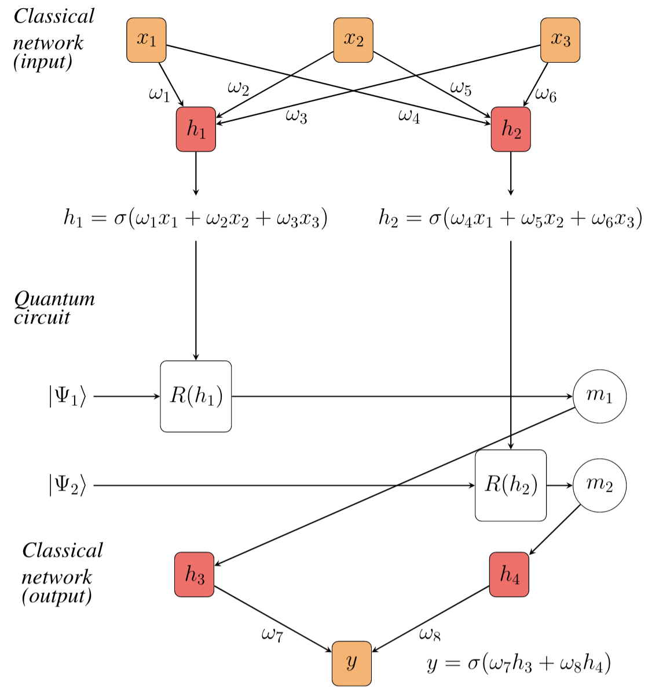
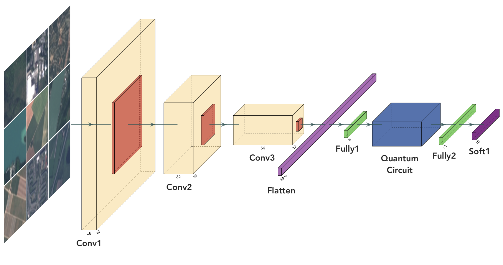

# QNN4O: a quantum convolutional neural network for satellite data classification

In this study we proposed an Hybrid Quantum Convolutional Neural Network to address the LULC (Land Use and Land Cover classification) challenge. We trained and test our model on the [EuroSAT dataset](https://github.com/phelber/EuroSAT) based on Sentinel-2 satellite images covering 13 spectral bands and consisting out of 10 classes with in total 27,000 labeled and geo-referenced images.

*Sample of EuroSAT dataset [Source https://github.com/phelber/EuroSAT]*

## Hybrid Quantum Neural Network
To create an hybrid QNN, a parametrized quantum circuit is typically used as a hidden layer for the neural network. A parametrized quantum circuit is a quantum circuit where the rotation angles for each gate are specified by the components of a classical input vector. The outputs from our neural network's previous layer will be collected and used as the inputs for our parametrized circuit. The measurement statistics of our quantum circuit can then be collected and used as inputs for the following hidden layer.

In this study we created an Hybird Convolutional Neural Network, by adding a Quantum Circuit in a modified version of the Lenet-5

## Results

| Class                 | Precision | Recall | F1 Score |
| :---                  |  :----:   | :----: |  :----:  |
| Annual Crop           |    0.98   |  0.93  |   0.95   |
| Permanent Crop        |    0.98   |  0.98  |   0.98   |
| Pasture               |    0.93   |  0.94  |   0.94   |
| Forest                |    0.95   |  0.95  |   0.95   |
| Herbaceous vegetation |    0.93   |  0.94  |   0.94   |
| Highway               |    0.99   |  0.99  |   0.99   |
| Residential           |    0.99   |  0.99  |   0.99   |
| Industrial            |    0.99   |  0.99  |   0.99   |
| River                 |    0.99   |  0.99  |   0.99   |
| Sea Lak               |    0.99   |  0.99  |   0.99   |
|                       |           |        |          |
| Accuracy              |           |        |   0.97   |
| Macro Average         |    0.97   |  0.97  |   0.97   |

## Folders organization

### JSTARS
We proposed a study on quantum circuits for image classification and several multiclass hybrid quantum classifiers. The experiments are collected in 

- [QCNN-RyCircuitQiskittextbook.ipynb](JSTARS2021/quantum_classifiers/eurosat_classification/QCNN-RyCircuitQiskittextbook.ipynb)
- [QCNN-RealAmplitudesCircuit.ipynb](JSTARS2021/quantum_classifiers/eurosat_classification/QCNN-RealAmplitudesCircuit.ipynb)
- [eurosat_classification/QCNN-BellCircuit.ipynb](JSTARS2021/quantum_classifiers/eurosat_classification/QCNN-BellCircuit.ipynb)

We also proposed an hierarchical quantum classifier, composed of coarse classifier for clustering the EuroSAT classes into three groups (Vegetation, Urban and Water Bodies) and of three fine grain classifiers. In this case the experiments are collected in 
- [Jupyeter Notebook *QCNN-RealAmplitudesCircuit-CoarseClassifier.ipynb*](JSTARS2021/quantum_classifiers/fine_land_cover_classification/QCNN-RealAmplitudesCircuit-CoarseClassifier.ipynb) 
- [Jupyeter Notebook *QCNN-RealAmplitudesCircuit-Group1.ipynb*](JSTARS2021/quantum_classifiers/fine_land_cover_classification/QCNN-RealAmplitudesCircuit-Group1.ipynb)
- [Jupyeter Notebook *QCNN-RealAmplitudesCircuit-Group2.ipynb*](JSTARS2021/quantum_classifiers/fine_land_cover_classification/QCNN-RealAmplitudesCircuit-Group2.ipynb)
- [Jupyeter Notebook *QCNN-RealAmplitudesCircuit-Group3.ipynb*](JSTARS2021/quantum_classifiers/fine_land_cover_classification/QCNN-RealAmplitudesCircuit-Group3.ipynb)

### IGARSS2021

We proposed several binary hybrid quantum classifiers for the EuroSAT dataset. The experiments are collected in the [Jupyeter Notebook *EuroSAT_Classification.ipynb*](IGARSS2021/EuroSAT_Classification.ipynb)

## Installation

This module has been implemented in [Python 3.6.8](https://www.python.org/downloads/release/python-368/).

After the installation of Python and [pip](https://pypi.org/project/pip/), you can clone this repository in your working directory.

Then you can create a virtual environment:
1. open your favorite terminal and navigate into your working directory
2. install the *virtualenv* command: `pip install virtualenv`
3. create a virtualenv: `virtualenv qnn4eo -p python3.6`
4. activate the virtualenv: 
    - Linux or MacOS: `source qnn4eo\bin\activate`
    - Windows: `qnn4eo/Scripts/activate`
5. install requirements: `pip install -r requirements.txt`
6. launch Jupyter Lab: `jupyter lab`

To run experiments on real Quantum Computers you have to create an [IBM Quantum Experience Account](https://quantum-computing.ibm.com/).

## Authors:
* Alessandro Sebastianelli (Univeristy of Sannio/ESA OSIP) [ ][linkedin_alessandro] [][github_alessandro]

* Daniela A. Zaidenberg (MIT) [ ][linkedin_daniela] 

* Dario Spiller (ASI/ESA) [ ][linkedin_dario] [][github_dario]

* Bertrand Le Saux (ESA) [ ][linkedin_bertrand] [][github_bertrand]

* Silvia L. Ullo (University of Sannio) [ ][linkedin_silvia]

## Cite our papers:

### IGARSS2021

    @inproceedings{zaidenberg2021advantages,
        title={Advantages and Bottlenecks of Quantum Machine Learning for Remote Sensing},
        author={D. A. Zaidenberg, A. Sebastianelli, D. Spiller, B. Le Saux, S.L. Ullo},
        booktitle={IGARSS 2021-2021 IEEE International Geoscience and Remote Sensing Symposium},
        year={2021},
        organization={IEEE}
    }

### JSTARS - Special Issue on Quantum Computing for Earth Observation

    @inproceedings{zaidenberg2021advantages,
        title={On Circuit-based Hybrid Quantum Neural Networks for Remote Sensing Imagery Classification},
        author={A. Sebastianelli, D. A. Zaidenberg, D. Spiller, B. Le Saux, S.L. Ullo},
        booktitle={JSTARS},
        year={2021},
        organization={IEEE}
    }

[linkedin_daniela]: https://www.linkedin.com/in/daniela-zaidenberg-1b9918196/
[linkedin_alessandro]: https://www.linkedin.com/in/alessandro-sebastianelli-58545915b/
[github_alessandro]: https://github.com/Sebbyraft
[linkedin_dario]: https://www.linkedin.com/in/phd-dario-spiller/
[github_dario]: https://github.com/DarioSpiller
[linkedin_bertrand]: https://www.linkedin.com/in/bertrand-le-saux-4127b785/
[github_bertrand]: https://github.com/blesaux
[linkedin_silvia]: https://www.linkedin.com/in/silvia-liberata-ullo-67280717/
