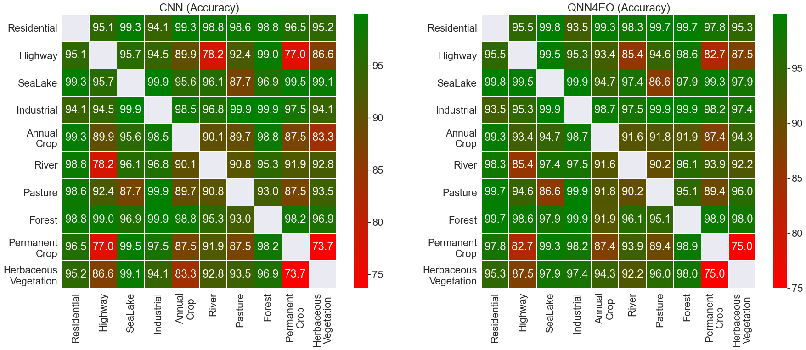

# QNN4O: a quantum convolutional neural network for satellite data classification

Authors:
* Daniela A. Zaidenberg (MIT) [ ][linkedin_daniela] 

* Alessandro Sebastianelli (Univeristy of Sannio/ESA OSIP) [ ][linkedin_alessandro] [][github_alessandro]

* Dario Spiller (ASI/ESA) [ ][linkedin_dario] [][github_dario]

* Bertrand Le Saux (ESA) [ ][linkedin_bertrand] [][github_bertrand]

* Silvia L. Ullo (University of Sannio) [ ][linkedin_silvia]

### Installation

This module has been implemented in [Python 3.6.8](https://www.python.org/downloads/release/python-368/).

After the installation of Python and [pip](https://pypi.org/project/pip/), you can clone this repository in your working directory.

Then you can create a virtual environment:
1. open your favorite terminal and navigate into your working directory
2. install the *virtualenv* command: `pip install virtualenv`
3. create a virtualenv: `virtualenv qnn4eo -p python3.6`
4. activate the virtualenv: 
    - Linux or MacOS: `source qnn4eo\bin\activate`
    - Windows: `qnn4eo/Scripts/activate`
5. install requirements: `pip install -r requirements.txt`
6. launch Jupyter Lab: `jupyter lab`
7. open *EuroSAT_Classification.ipynb*

## Some results

#### Cite our paper

        @inproceedings{zaidenberg2021advantages,
            title={Advantages and Bottlenecks of Quantum Machine Learning for Remote Sensing},
            author={D. A. Zaidenberg, A. Sebastianelli, D. Spiller, B. Le Saux, S.L. Ullo},
            booktitle={Submitted to IGARSS 2021-2021 IEEE International Geoscience and Remote Sensing Symposium},
            year={2021},
            organization={IEEE}
        }

[linkedin_daniela]: https://www.linkedin.com/in/daniela-zaidenberg-1b9918196/
[linkedin_alessandro]: https://www.linkedin.com/in/alessandro-sebastianelli-58545915b/
[github_alessandro]: https://github.com/Sebbyraft
[linkedin_dario]: https://www.linkedin.com/in/phd-dario-spiller/
[github_dario]: https://github.com/DarioSpiller
[linkedin_bertrand]: https://www.linkedin.com/in/bertrand-le-saux-4127b785/
[github_bertrand]: https://github.com/blesaux
[linkedin_silvia]: https://www.linkedin.com/in/silvia-liberata-ullo-67280717/